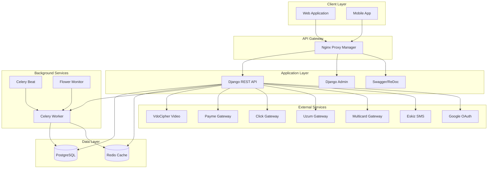
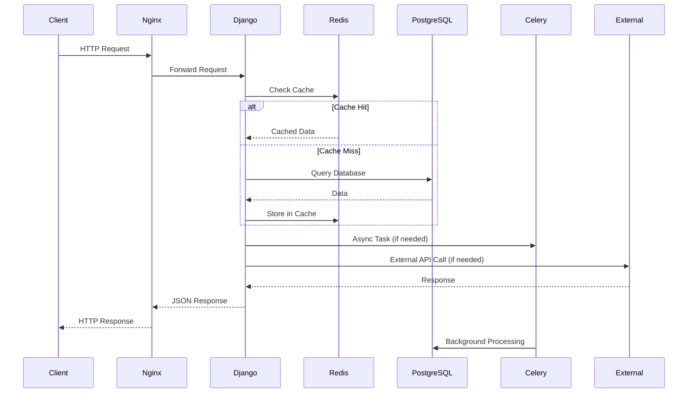
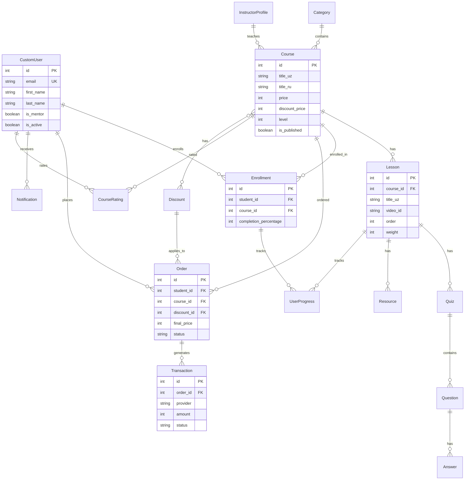
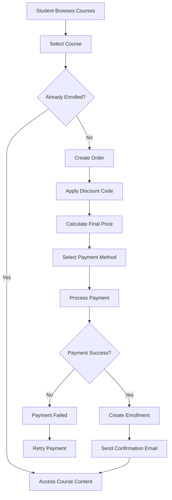
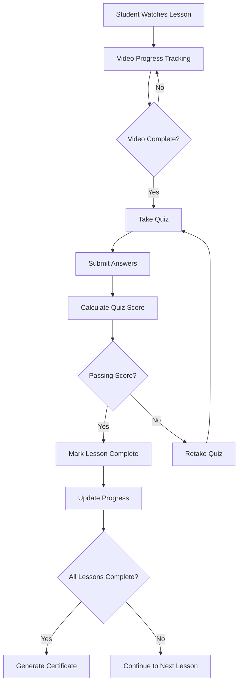
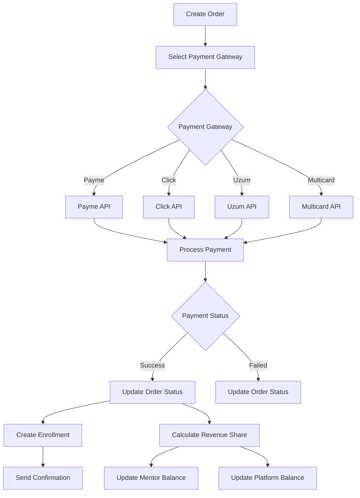

<div align="center">

<!-- Logo Placeholder - Replace with your logo URL -->
<!--  -->

# 🎓 Edu NeoSoft API

**A Comprehensive Educational Platform Backend System**

[](https://www.djangoproject.com/)
[](https://www.python.org/)
[](https://www.postgresql.org/)
[](https://redis.io/)
[](https://celeryproject.org/)
[](https://www.docker.com/)

[](https://edu.neosoft.uz/api/swagger/)
[](LICENSE)

</div>

---

<div align="center">

### 🖼️ Homepage Preview

<!-- Replace with your homepage screenshot URL or path -->


*Edu NeoSoft Platform Homepage*

</div>

---

## 📋 Table of Contents

- [Overview](#-overview)
- [Features](#-features)
- [Architecture](#-architecture)
- [Tech Stack](#-tech-stack)
- [Project Structure](#-project-structure)
- [Database Schema](#-database-schema)
- [Installation](#-installation)
- [Configuration](#-configuration)
- [API Documentation](#-api-documentation)
- [Deployment](#-deployment)
- [Contributing](#-contributing)

---

## 🎯 Overview

**Edu NeoSoft API** is a robust, scalable backend system powering a modern educational platform. It provides comprehensive functionality for managing online courses, student enrollments, mentor contracts, payment processing, and real-time notifications. Built with Django REST Framework, the system supports multi-language content (Uzbek/Russian), secure video streaming, and seamless integration with multiple payment gateways.

### Key Highlights

- 🎓 **Course Management**: Complete CRUD operations for courses, lessons, quizzes, and resources
- 👥 **Multi-Role System**: Separate authentication and permissions for Students, Mentors, and Managers
- 💳 **Payment Integration**: Support for Payme, Click, Uzum, and Multicard payment systems
- 📊 **Progress Tracking**: Real-time student progress monitoring with completion percentages
- 🔔 **Notification System**: Real-time notifications with expiration and read status
- 📄 **Contract Management**: Automated PDF contract generation for mentors
- 🎥 **Video Streaming**: Secure video delivery via VdoCipher integration
- 🌍 **Internationalization**: Full support for Uzbek and Russian languages
- ⚡ **Async Processing**: Celery-based background tasks for heavy operations

---

## ✨ Features

### Authentication & Authorization
- Custom user model with role-based access control (Student, Mentor, Manager)
- JWT-based authentication with refresh tokens
- Google OAuth integration
- Email verification system
- Phone number validation for Uzbek format

### Course Management
- Hierarchical category system with parent-child relationships
- Multi-level course structure (Beginner, Intermediate, Advanced)
- Lesson management with video content (VdoCipher)
- Quiz system with multiple-choice questions
- Course prerequisites and dependencies
- Course ratings and reviews
- Resource attachments (PDF, DOCX, PPTX, ZIP)

### Student Features
- Course enrollment and progress tracking
- Lesson completion tracking
- Quiz scoring and results
- Course completion certificates
- Personalized learning dashboard
- Discount code application

### Mentor Features
- Profile management with detailed information
- Course creation and management
- Lesson approval workflow
- Contract generation and signing
- Revenue tracking and balance management
- Performance analytics

### Payment System
- Multiple payment gateway integration (Payme, Click, Uzum, Multicard)
- Order management with discount application
- Transaction history and tracking
- Revenue sharing between platform and mentors
- Platform balance management

### Additional Features
- Discount system with promo codes and holiday discounts
- Real-time notification system
- Chat service integration
- Email and SMS notifications
- Automated contract PDF generation
- Redis caching for performance
- Celery task queue for async operations

---

## 🏗️ Architecture

### System Architecture Diagram



### Request Flow Diagram



---

## 🛠️ Tech Stack

### Backend Framework
- **Django 5.2.6** - High-level Python web framework
- **Django REST Framework 3.16.1** - Powerful toolkit for building Web APIs
- **djangorestframework-simplejwt 5.5.1** - JWT authentication

### Database & Caching
- **PostgreSQL 16** - Primary relational database
- **Redis 7** - Caching and session storage
- **django-redis 6.0.0** - Redis integration for Django

### Task Queue
- **Celery 5.5.3** - Distributed task queue
- **django-celery-beat 2.8.1** - Periodic task scheduler
- **Flower 2.0.1** - Celery monitoring tool

### Payment Gateways
- **payme-pkg 3.0.29** - Payme payment integration
- Custom implementations for Click, Uzum, and Multicard

### Video & Media
- **VdoCipher** - Secure video streaming platform
- **Pillow 11.3.0** - Image processing
- **WeasyPrint 66.0** - PDF generation for contracts

### Authentication & Social
- **django-allauth 65.11.1** - Authentication system
- **social-auth-app-django 5.5.1** - Social authentication
- **google-api-python-client 2.184.0** - Google OAuth

### API Documentation
- **drf-yasg 1.21.10** - Swagger/OpenAPI documentation

### Other Key Libraries
- **django-filter 25.1** - Advanced filtering
- **django-cors-headers 4.8.0** - CORS handling
- **django-environ 0.12.0** - Environment variables
- **gunicorn 23.0.0** - WSGI HTTP server
- **openai 1.107.1** - AI integration (for chat service)

---

## 📁 Project Structure

```
edu-neosoft-api/
├── authentication/          # User authentication & authorization
│   ├── google/              # Google OAuth integration
│   ├── manager/             # Manager-specific views
│   ├── mentors/             # Mentor profiles & contracts
│   └── students/            # Student-specific views
│
├── content/                 # Course & content management
│   ├── mentors/             # Mentor content views
│   ├── students/            # Student content views
│   ├── chat_service/        # Chat functionality
│   └── vdocipher/           # Video streaming integration
│
├── payment/                 # Payment processing
│   ├── click/               # Click payment gateway
│   ├── payme/               # Payme payment gateway
│   ├── uzum/                # Uzum payment gateway
│   ├── multicard/           # Multicard payment gateway
│   ├── manager/             # Manager payment views
│   └── students/            # Student payment views
│
├── notification/            # Notification system
│   └── services.py          # Notification services
│
├── discount/                # Discount & promo code system
│
├── emails/                  # Email templates & sending
│   ├── auth/                # Authentication emails
│   └── content/             # Content-related emails
│
├── sms/                     # SMS sending service
│   └── eskiz_client.py      # Eskiz SMS integration
│
├── utils/                   # Utility functions
│   ├── generator_contract_pdf.py
│   ├── sender_notification.py
│   └── check_course_completion_code.py
│
├── signals/                 # Django signals
│   ├── create_mentor_balance.py
│   ├── discount_calculations.py
│   └── payment_seperation.py
│
├── tasks/                   # Celery tasks
│   └── clean_expired_notifications.py
│
├── permissions/             # Custom permissions
│
├── filters/                 # Custom filters
│
├── validators/              # Custom validators
│
├── i18n/                    # Internationalization
│
├── templates/               # HTML templates
│
├── static/                  # Static files
│   └── images/              # Images (logo, stamps)
│
├── media/                   # User-uploaded media
│
├── edu_neosoft_api/        # Main project settings
│   ├── settings/            # Environment-specific settings
│   ├── urls.py              # Root URL configuration
│   ├── celery.py            # Celery configuration
│   └── wsgi.py              # WSGI configuration
│
├── docker-compose.yml       # Docker Compose configuration
├── Dockerfile               # Docker image definition
├── requirements.txt         # Python dependencies
└── manage.py               # Django management script
```

---

## 🗄️ Database Schema

### Core Entity Relationship Diagram



### Key Models Overview

| Model | Description | Key Fields |
|-------|-------------|------------|
| `CustomUser` | Base user model for all roles | email, first_name, last_name, is_mentor |
| `Category` | Course categories with hierarchy | name_uz, name_ru, parent, slug |
| `Course` | Course information | title_uz, title_ru, price, level, instructor |
| `Lesson` | Individual lessons within courses | title_uz, video_id, order, weight |
| `Enrollment` | Student course enrollments | student, course, completion_percentage |
| `UserProgress` | Student progress tracking | enrollment, lesson, completed_at, quiz_score |
| `Order` | Course purchase orders | student, course, final_price, status |
| `Transaction` | Payment transactions | order, provider, amount, status |
| `Discount` | Discount codes and promotions | name, discount_type, value, promo_code |
| `Notification` | User notifications | user, type, title, message, is_read |

---

## 🚀 Installation

### Prerequisites

- Python 3.12+
- PostgreSQL 16+
- Redis 7+
- Docker & Docker Compose (optional, for containerized deployment)

### Local Development Setup

1. **Clone the repository**
   ```bash
   git clone https://gitlab.com/edvent/edu-neosoft-api.git
   cd edu-neosoft-api
   ```

2. **Create and activate virtual environment**
   ```bash
   python3.12 -m venv venv
   source venv/bin/activate  # On Windows: venv\Scripts\activate
   ```

3. **Install dependencies**
   ```bash
   pip install -r requirements.txt
   ```

4. **Set up environment variables**
   ```bash
   cp .env.example .env
   # Edit .env with your configuration
   ```

5. **Set up PostgreSQL database**
   ```bash
   createdb edu_neosoft
   ```

6. **Run migrations**
   ```bash
   python manage.py migrate
   ```

7. **Create superuser**
   ```bash
   python manage.py createsuperuser
   ```

8. **Collect static files**
   ```bash
   python manage.py collectstatic --noinput
   ```

9. **Run development server**
   ```bash
   python manage.py runserver
   ```

### Docker Setup

1. **Build and start containers**
   ```bash
   docker-compose up -d --build
   ```

2. **Run migrations**
   ```bash
   docker-compose exec api python manage.py migrate
   ```

3. **Create superuser**
   ```bash
   docker-compose exec api python manage.py createsuperuser
   ```

4. **Access services**
   - API: http://localhost:8000
   - Admin: http://localhost:8000/api/admin/
   - Swagger: http://localhost:8000/api/swagger/
   - Flower: http://localhost:5555

---

## ⚙️ Configuration

### Environment Variables

Create a `.env` file in the project root with the following variables:

```env
# Django Settings
SECRET_KEY=your-secret-key-here
DEBUG=True
ALLOWED_HOSTS=localhost,127.0.0.1

# Database
DB_NAME=edu_neosoft
DB_USER=postgres
DB_PASSWORD=postgres123
DB_HOST=localhost
DB_PORT=5432

# Redis
REDIS_HOST=localhost
REDIS_PORT=6379
REDIS_DB=0

# Celery
CELERY_BROKER_URL=redis://localhost:6379/0
CELERY_RESULT_BACKEND=redis://localhost:6379/0

# VdoCipher
VDOCIPHER_API_KEY=your-vdocipher-api-key

# Payment Gateways
PAYME_MERCHANT_ID=your-payme-merchant-id
PAYME_KEY=your-payme-key
CLICK_MERCHANT_ID=your-click-merchant-id
CLICK_SERVICE_ID=your-click-service-id
CLICK_SECRET_KEY=your-click-secret-key

# Google OAuth
GOOGLE_CLIENT_ID=your-google-client-id
GOOGLE_CLIENT_SECRET=your-google-client-secret

# SMS Service
ESKIZ_EMAIL=your-eskiz-email
ESKIZ_PASSWORD=your-eskiz-password

# Email Settings
EMAIL_HOST=smtp.gmail.com
EMAIL_PORT=587
EMAIL_USE_TLS=True
EMAIL_HOST_USER=your-email@gmail.com
EMAIL_HOST_PASSWORD=your-email-password

# OpenAI (for chat service)
OPENAI_API_KEY=your-openai-api-key
```

### Settings Structure

The project uses environment-specific settings:
- `base.py` - Base settings (shared configuration)
- `prod.py` - Production settings (imports from base)

---

## 📚 API Documentation

### Interactive Documentation

- **Swagger UI**: `/api/swagger/` - Interactive API documentation
- **ReDoc**: `/api/redoc/` - Alternative API documentation

### Main API Endpoints

#### Authentication
- `POST /api/authentication/register/` - User registration
- `POST /api/authentication/login/` - User login
- `POST /api/authentication/logout/` - User logout
- `POST /api/authentication/refresh/` - Refresh JWT token
- `GET /api/authentication/profile/` - Get user profile
- `PUT /api/authentication/profile/` - Update user profile

#### Courses
- `GET /api/content/courses/` - List all courses
- `GET /api/content/courses/{id}/` - Get course details
- `POST /api/content/courses/{id}/enroll/` - Enroll in course
- `GET /api/content/courses/{id}/lessons/` - Get course lessons
- `GET /api/content/lessons/{id}/` - Get lesson details

#### Payments
- `POST /api/payment/orders/` - Create order
- `POST /api/payment/orders/{id}/pay/` - Process payment
- `GET /api/payment/transactions/` - Get transaction history

#### Notifications
- `GET /api/notification/` - Get user notifications
- `PUT /api/notification/{id}/read/` - Mark notification as read

### Authentication

The API uses JWT (JSON Web Tokens) for authentication. Include the token in the Authorization header:

```
Authorization: Bearer <your-access-token>
```

---

## 🐳 Deployment

### Production Deployment with Docker

1. **Update environment variables for production**
   ```bash
   # Edit .env file with production values
   DEBUG=False
   ALLOWED_HOSTS=your-domain.com,www.your-domain.com
   ```

2. **Build and deploy**
   ```bash
   docker-compose -f docker-compose.yml up -d --build
   ```

3. **Run migrations**
   ```bash
   docker-compose exec api python manage.py migrate
   ```

4. **Collect static files**
   ```bash
   docker-compose exec api python manage.py collectstatic --noinput
   ```

### Services Overview

The Docker Compose setup includes:
- **API**: Django application (Gunicorn)
- **PostgreSQL**: Database server
- **Redis**: Cache and message broker
- **Celery Worker**: Background task processor
- **Celery Beat**: Periodic task scheduler
- **Flower**: Celery monitoring dashboard
- **Nginx**: Reverse proxy and load balancer

### Monitoring

- **Flower**: Monitor Celery tasks at `http://your-domain:5555`
- **Django Admin**: Access admin panel at `/api/admin/`
- **API Health**: Check API status via health check endpoint

---

## 🔄 Workflow Diagrams

### Course Enrollment Flow



### Lesson Completion Flow



### Payment Processing Flow



---

## 🧪 Testing

```bash
# Run tests
python manage.py test

# Run tests with coverage
coverage run --source='.' manage.py test
coverage report
```

---

## 📊 Performance Optimizations

- **Redis Caching**: Frequently accessed data cached in Redis
- **Database Indexing**: Optimized queries with proper indexes
- **Select Related**: Reduced database queries with `select_related` and `prefetch_related`
- **Pagination**: API responses paginated for large datasets
- **Async Tasks**: Heavy operations moved to Celery background tasks
- **CDN Integration**: Static files served via CDN (production)

---

## 🔒 Security Features

- JWT-based authentication with refresh tokens
- CORS configuration for API access control
- SQL injection prevention (Django ORM)
- XSS protection (Django template escaping)
- CSRF protection for state-changing operations
- Secure password hashing (Django's PBKDF2)
- Environment variable management for secrets
- Rate limiting on sensitive endpoints

---

## 📝 License

This project is proprietary software. All rights reserved.

---

## 👥 Team

**Edu NeoSoft Development Team**

- **Contact**: dilshod.normurodov1392@gmail.com
- **Website**: https://edu.neosoft.uz

---

## 🎯 Roadmap

- [ ] Mobile app API endpoints optimization
- [ ] Advanced analytics dashboard
- [ ] Live streaming integration
- [ ] AI-powered course recommendations
- [ ] Enhanced reporting system
- [ ] Multi-currency support
- [ ] WebSocket support for real-time features

---

## 📞 Support

For support, email dilshod.normurodov1392@gmail.com or create an issue in the repository.

---

<div align="center">

**Built with ❤️ by the Edu NeoSoft Team**

[](https://edu.neosoft.uz)
[](mailto:dilshod.normurodov1392@gmail.com)

</div>
